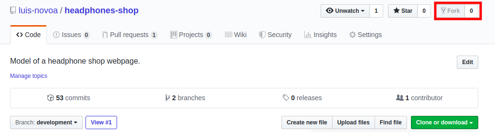

# bowling_score_processor

In this project, I built an algorithm that turns a list of individual bowling rounds into a standardized score card.


## Features
- Receives .txt documents
- Output processed data on the terminal
- Check for inconsistences in the input

## How to Use
1 - Install the project in your computer. Check the [Getting Started](##getting-started) section to do it using GitHub.

2 - Access the project's folder and add the .txt file you want to process in the input folder.

3 - Access the project's folder through the command line.

4 - Run the program with the following code (substitute ``example.txt`` with the file you want to process):

```
$ bin/bowling_processor.rb example.txt
```
5 - The program will check the integrity of your input and return the standardized bowling score.

## Getting Started

This project is open for anyone who wants to clone it and create their version. Follow the steps below to get a copy in your computer:

1 - Install git in your machine. Follow [this guide](https://www.theodinproject.com/courses/web-development-101/lessons/setting-up-git) by The Odin Project if you haven't done so.

2 - Click the "Fork" button in the repository's page, which will create a repository named "<yourUserName>/headphones-shop".



3 - On your forked repository, click on the "Clone or download" button and copy the URL address provided.


4 - Open your terminal, select the folder where you want to store this project and paste the following code

```
git clone <copiedUrl>
```


Now you have a copy of this repository in your profile and in your computer!

## Built With
- Ruby v2.6.5
- Visual Studio Code

### Run tests
This project was done entirely using the TDD methodology. So far, 22 tests were created and all of them are satisfied. Run the following code to execute them:

```
$ rspec --format documentation
```

## Author

👤 **Luis Novoa**

- GitHub: [luis-novoa](https://github.com/luis-novoa)
- Twitter: [@LuisMatteNovoa](https://twitter.com/LuisMatteNovoa)
- Linkedin: [Luis Novoa](https://www.linkedin.com/in/luismattenovoa/)

## Show your support

Give a ⭐️ if you like this project!

## 📝 License

This project is [MIT](./LICENSE) licensed.